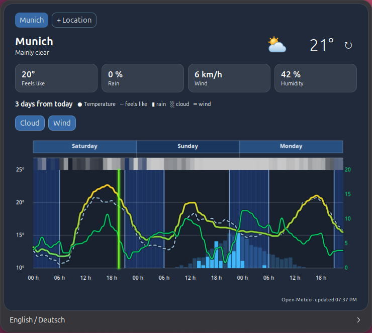

# Wetterkurve

Wetterkurve is a native GNOME Shell extension that keeps a compact weather
overview for up to three saved locations in the top panel. Its popup shows a
three-day chart from today at midnight to 23:00 two days later, including
temperature, feels-like temperature, precipitation probability, precipitation,
and an alternating weekday strip.

Forecasts and location search come directly from the [Open-Meteo API](https://open-meteo.com/).
No API key is required.



## Features

- Current conditions and temperature in the top panel
- Save and switch between up to three locations
- Live location search
- Temperature and feels-like curves plus precipitation information
- Automatic refresh every 20 minutes and a manual refresh button
- German on German-language systems; English on all other systems

## Install

1. Download `wetterkurve@wean.de.shell-extension.zip` from the
   [latest GitHub release](https://github.com/vibecodingwean/wetterkurve/releases/latest).
2. Install it from a terminal:

   ```bash
   gnome-extensions install --force ~/Downloads/wetterkurve@wean.de.shell-extension.zip
   ```

3. Enable **Wetterkurve** in the GNOME **Extensions** app.

On Wayland, log out and back in once if GNOME Shell does not discover the
extension immediately.

### Development install

```bash
./install.sh
```

This creates a development symlink instead of installing a release ZIP.

## Develop and package

```bash
./test.sh
```

This compiles the local GSettings schema, runs the tests and validation, and
creates `dist/wetterkurve@wean.de.shell-extension.zip`.

## Release

The repository contains an intentionally small release gate:

1. Run `./scripts/install-git-hooks.sh` once to enable the versioned local
   check on a developer machine.
2. Tag a tested commit as `vX.Y.Z` and push the tag.
3. GitHub Actions repeats the verification and tests, then creates a GitHub
   release with the installable ZIP attached.
4. Submit a tested tag to extensions.gnome.org manually through the protected
   **Submit Wetterkurve to GNOME Extensions** workflow.

Configure the `EGO_USERNAME` and `EGO_PASSWORD` secrets only in that protected
GitHub environment. Details and the first-release checklist are in
[docs/PUBLISHING.md](docs/PUBLISHING.md).

## License

MIT. See [LICENSE](LICENSE).
